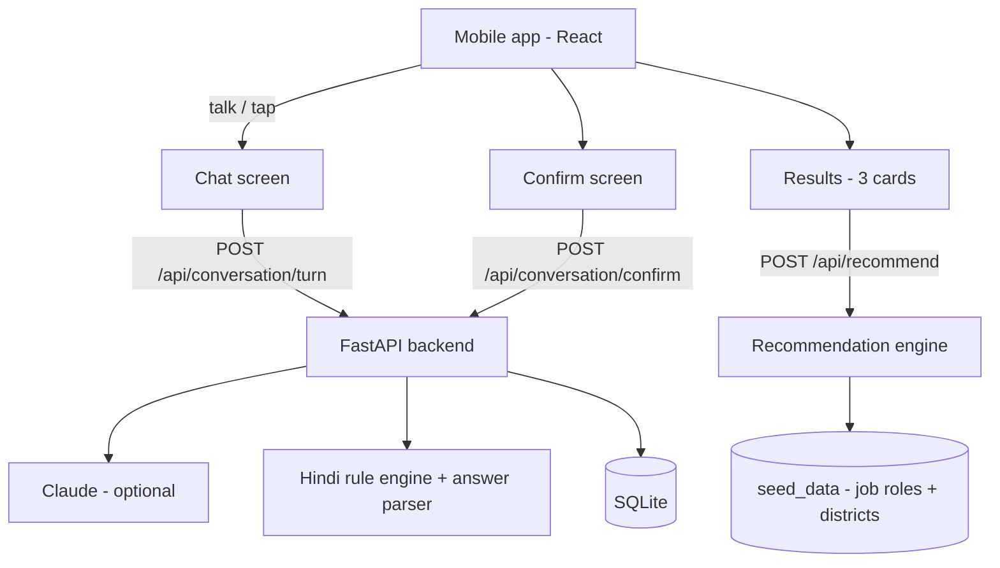

# Kaushal Saathi (कौशल साथी)

**Smart India Hackathon 2026 — Problem Statement 26097**

A voice assistant that helps people from SC communities find skilling and livelihood options under the GIA component of PM-AJAY (MoSJE).

## The problem

Skilling websites are full of forms and English words. A person who has not been to school cannot use them. So we thought — why not let the person just talk?

## What we built

Kaushal Saathi is a voice assistant in Hindi. It talks to the person like a friend, asks simple questions one at a time — age, district, education, what work the family does, what they already know, and so on — and builds a profile by talking. No forms, no jargon.

Then it suggests the **top 3 training and work options** (NSQF-aligned job roles) that suit the person. For every suggestion it shows:

- why it fits (in simple Hindi)
- what skills they already have and what they will learn in training
- how long the training is and where the nearest centre is
- one government scheme name to check (only as a pointer — we never claim eligibility)

Every card also has a **"यह क्यों? / Why this?"** button. It opens the actual score breakdown — 5 numbers with weights and a reason for each. Nothing is hidden inside a black box.

At the end there is a simulated SMS/WhatsApp summary screen and a "delete my data" button that really deletes everything.

## How to run it

**Using Docker:**
```
docker compose up --build
```
Open http://localhost:8080

**Without Docker:**
```
bash scripts/dev.sh
```
Open http://localhost:5173

That's it. The demo does not need internet and does not need any API key.

If you have an Anthropic API key, copy `.env.example` to `.env` and put it there. Then the conversation is powered by Claude and feels more natural. Without the key, our own Hindi rule engine runs the whole conversation — the demo still works fine. (The key stays on the backend, never in the browser.)

## Try it in 2 minutes

1. Open the app. Press the speaker button — the consent is read out loud in Hindi. Press **हाँ, आगे बढ़ें**.
2. Press the big mic and answer, or just tap the answer chips. Try this conversation:
   - "मेरा नाम सुनीता है"
   - "तीस साल"
   - "मैं गोंडा से हूँ"
   - "दसवीं तक पढ़ी हूँ"
   - "घर में सब खेती करते हैं"
   - "अभी खेत में मज़दूरी करती हूँ"
   - "मुझे सिलाई आती है, खाना भी बना लेती हूँ"
   - "कपड़ों का काम पसंद है"
   - "घुटनों में दर्द रहता है, भारी काम नहीं कर पाती"
   - "मुझे अपना छोटा काम शुरू करना है"
   - "हाँ, दस-बीस किलोमीटर जा सकती हूँ"
3. The assistant reads your whole profile back ("आपने बताया कि…"). Say "हाँ, सही है" or tap any field to change it.
4. You get 3 cards. Press the speaker icon on a card to hear it, and open "यह क्यों?" to see the scoring.
5. Press "मेरा डेटा मिटाएँ" — all your data is really deleted.

A longer 3-minute walkthrough for the presentation is in `docs/DEMO_SCRIPT.md`.

## How a suggestion is scored

```
score = 30%  how well the role matches your profile and background (TF-IDF text match)
        20%  education eligibility (you meet the minimum or not)
        20%  demand in your district
        15%  physical and travel fit
        15%  job vs self-employment preference
```

These 5 numbers are exactly what the "why this?" box shows. The engine runs completely offline on our seed data.

## How the code is organised

```
backend/         FastAPI app
  app/services/    dialogue engine, Hindi answer parser, recommendation engine
  app/routers/     conversation, recommendations, session + delete-my-data
  tests/           62 tests (parser, scorer, conversation, API)
frontend/        React + Vite + Tailwind app (Consent → Chat → Confirm → Results)
  src/speech/      browser speech adapters (swap in Bhashini/Whisper later)
seed_data/       job roles + districts (clearly marked as demo data)
docs/            demo script + data sources
```

## Architecture



## What is real and what is fake

We want to be honest here, because this is a prototype:

- **The data is made up for the demo.** The 42 job roles and the 3 districts (Gonda, Barmer, Alirajpur) are hand-written by us. Every file in `seed_data/` says this at the top. The real version will use official NCVET/NSQF qualification packs, NSDC and NCS data (list below).
- **No salary, placement or eligibility claims anywhere.** Where we are not sure, we only use low / medium / high. Scheme names are pointers to check, and every one of them contains the word "verify" on purpose.
- **Training centres and distances are dummy values** made for the demo.
- **Speech uses the browser's Web Speech API** (works in Chrome/Edge, needs HTTPS or localhost). For production we would use Bhashini or Whisper — the adapter interface is already there (`backend/app/adapters/speech.py`) but not connected.
- **The SMS/WhatsApp summary is only a preview.** Nothing is actually sent. Real sending needs SMS DLT registration and WhatsApp Business API.
- **Not built yet:** officials' dashboard, 30/60/90-day follow-up calls, IVR and WhatsApp channels. These are the next steps below.
- **Not done for production:** login, security hardening, formal accessibility audit.

## Next steps

1. Officials' dashboard — district-wise graphs of profiles, top suggested roles, common skill gaps, demand vs available training.
2. 30/60/90-day follow-up call simulation (enrolled / completed / placed).
3. IVR flow for feature phones and WhatsApp voice-note channel.
4. Replace seed data with real official data (see below) and connect Bhashini speech.

## Official data sources to plug in later

| Source | For what |
|---|---|
| NCVET / NSQF Qualification Packs | real job roles, NSQF levels, course duration |
| NSDC / PMKVY centre locator | real training centres near the person |
| NCS (National Career Service) | local job demand |
| e-Shram | worker data (aggregated, anonymised) |
| PLFS (MoSPI) | district-level livelihood and employment data |
| Udyam | local small businesses — for self-employment ideas |
| Bhashini | Indian language speech (STT/TTS) |
| MoSJE / PM-AJAY guidelines | actual scheme names and eligibility rules |

More detail is in `docs/DATA_SOURCES.md`.

## Running the tests

```
cd backend && ../.venv/bin/python -m pytest tests -q
```

62 tests cover the Hindi answer parser, the scoring engine, the full conversation flow and the API.

## Tech stack

- Frontend: React + Vite + Tailwind (mobile-first, big buttons)
- Backend: FastAPI + SQLite (same schema runs on PostgreSQL)
- Speech: browser Web Speech API, behind an adapter
- LLM: Claude via backend `.env` (optional)
- Recommendations: TF-IDF + weighted rules — simple and explainable on purpose

## Team note

Everything here runs end to end. If something breaks or you want a change, the demo is designed so it still works offline and without an API key — the two things that usually break during a hackathon demo.
