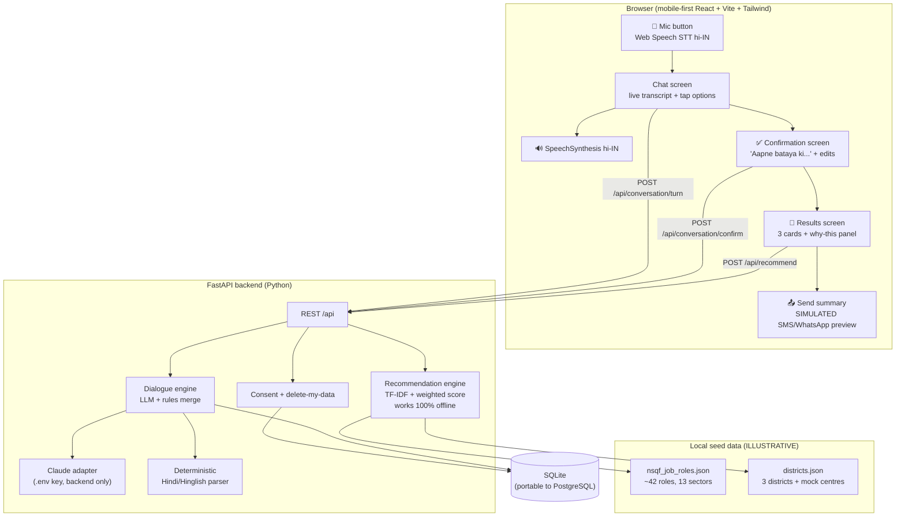

# कौशल साथी · Kaushal Saathi

**AI-Driven Voice Assistant for Livelihood Mapping and NSQF-Aligned Skilling
Recommendations for SC Communities under the GIA component of PM-AJAY (MoSJE)**

Smart India Hackathon 2026 — Problem Statement **26097** · Demo-ready prototype

> A beneficiary with low literacy talks to a warm voice assistant in Hindi
> (Hinglish-friendly). The assistant holds a conversation — not a form — builds a
> structured profile, and recommends the **top 3 NSQF-aligned skilling and
> livelihood pathways** with a visible, transparent score. An officials'
> dashboard (aggregated, anonymised) is planned — see [Roadmap](#roadmap).

---

## ⚡ Quick start (one command)

**Option A — Docker:**
```bash
docker compose up --build
# open http://localhost:8080
```

**Option B — without Docker:**
```bash
bash scripts/dev.sh
# open http://localhost:5173
```

**Optional — enable the LLM brain:** copy `.env.example` to `.env` at the repo root and
add your `ANTHROPIC_API_KEY`. Without a key, the built-in Hindi rule engine runs the
whole conversation — the demo still works end to end (and is fully offline-capable).

**Run tests:**
```bash
.venv/bin/python -m pytest backend/tests -q        # 48 tests
```

---

## 🧭 What is implemented vs. designed (honest status)

| Piece | Status |
|---|---|
| Voice conversation flow (mic, live transcript, spoken replies, tap fallback) | ✅ implemented |
| LLM slot-filling (Claude, JSON turn contract) + rule-based Hindi fallback engine | ✅ implemented |
| Confirmation read-back + corrections by voice/text | ✅ implemented |
| Recommendation engine (TF-IDF + weighted score, breakdown visible) | ✅ implemented |
| Results screen (3 cards, play-back, skill-gap bars, simulated SMS/WhatsApp summary) | ✅ implemented |
| Consent screen (voice-readable) + "delete my data" endpoint | ✅ implemented |
| Browser STT/TTS adapters (Web Speech API, `hi-IN`) behind swappable interfaces | ✅ implemented (browser) |
| Bhashini / Whisper speech adapters | 📐 designed (interfaces only — `backend/app/adapters/speech.py`) |
| Officials' dashboard (Recharts) | 📐 next (agreed stop-point) |
| 30/60/90-day follow-up simulation | 📐 planned |
| IVR (DTMF) + WhatsApp voice-note channel pages | 📐 planned (mock-up diagrams) |

## 🏗️ Architecture



### Conversation turn contract (LLM ↔ backend)

```json
{
  "reply_text": "…Hindi reply + one question…",
  "reply_text_en": "…English translation…",
  "extracted_fields": {"age": 25, "district": "Gonda", "skills": ["sewing"]},
  "missing_fields": ["education", "preference"],
  "is_complete": false
}
```

### Recommendation score (transparent, no black box)

```
score = 0.30 · similarity    TF-IDF cosine(profile, role) ×2, capped at 1
      + 0.20 · education     1.0 eligible · 0.25 near-miss (bridge course) · 0 otherwise
      + 0.20 · demand        matching district demand tags ÷ 2, capped at 1
      + 0.15 · mobility      0.7 · physical-fit + 0.3 · travel-fit (centre distance)
      + 0.15 · preference    self-employment potential vs stated preference
```

Every component (0–1) is returned with a plain-language note and rendered in the
**"यह क्यों? / Why this?"** panel on each result card.

## 📁 Folder structure

```
sih/
├── backend/
│   ├── app/
│   │   ├── main.py            FastAPI app
│   │   ├── config.py          settings (.env)
│   │   ├── database.py        SQLAlchemy 2.0 — SQLite ↔ PostgreSQL portable
│   │   ├── models.py          sessions / profiles / conversation_turns
│   │   ├── schemas.py         typed Pydantic models (Profile, TurnResponse, Recommendation…)
│   │   ├── routers/           conversation · recommend · session(consent/delete) · meta
│   │   ├── services/
│   │   │   ├── dialogue.py    turn orchestration (LLM + rules merge)
│   │   │   ├── llm.py         Claude adapter + JSON parser + graceful fallback
│   │   │   ├── extraction.py  deterministic Hindi/Hinglish profile parser
│   │   │   ├── recommender.py TF-IDF + weighted scorer
│   │   │   └── seed_loader.py cached seed data (offline)
│   │   └── adapters/speech.py STT/TTS adapter interfaces (Bhashini/Whisper ready)
│   └── tests/                 test_extraction · test_recommender · test_api (48 tests)
├── frontend/
│   └── src/
│       ├── speech/            stt.js / tts.js (Web Speech API adapters)
│       ├── pages/             Consent → Chat → Confirm → Results
│       └── components/        MicButton · TapOptions · ResultCard · WhyPanel · SendSummaryModal
├── seed_data/                 ILLUSTRATIVE datasets (see seed_data/README.md)
├── docs/                      DEMO_SCRIPT.md · DATA_SOURCES.md
├── Dockerfile · docker-compose.yml · scripts/dev.sh · .env.example
└── README.md
```

## 📱 How to test each feature

1. **Consent** — open the app → 🔊 button reads consent aloud → "हाँ, आगे बढ़ें".
2. **Voice conversation** — press the 🎤 button, speak in Hindi/Hinglish
   ("मेरा नाम राहुल है", "25 साल", "गोंडा से हूँ"…). Watch the live transcript,
   the spoken reply, and the slot chips fill. Blocked? Tap the quick-answer chips
   or type in the box — both are full fallbacks (shown automatically after 2
   speech failures).
3. **Confirmation** — when all slots are filled the assistant reads the profile
   back ("आपने बताया कि…"). Tap any field to edit, or say/type a correction
   ("umar 26 hai").
4. **Results** — 3 large cards. Press ▶ on any card to hear it. Open
   "यह क्यों?" to see the 5-part score breakdown with weights and notes.
   Check the skill-gap bars (values are real ratios, clamped 0–100).
5. **Send summary** — 📤 button → SMS/WhatsApp preview (clearly *simulated*).
6. **Privacy** — 🗑️ "मेरा डेटा मिटाएँ" calls `DELETE /api/session/{id}` and wipes
   turns + profile + session.
7. **Offline/reliability** — stop the backend → the app shows a friendly error;
   the recommendation engine itself needs no internet (cached seed data), and
   with no `ANTHROPIC_API_KEY` the conversation runs on the rule engine.

## 🔌 API surface

| Method | Path | Purpose |
|---|---|---|
| POST | `/api/session` | create session + record consent |
| POST | `/api/conversation/turn` | one conversation turn → `TurnResponse` |
| POST | `/api/conversation/confirm` | read-back + corrections + confirm |
| POST | `/api/recommend` | top-3 recommendations + score breakdowns |
| DELETE | `/api/session/{id}` | **delete my data** |
| GET | `/api/health`, `/api/meta` | health + honesty/data notices |
| GET | `/docs` | OpenAPI (auto) |

## ⚠️ Limitations and next steps — what is mocked, honestly

1. **All seed data is ILLUSTRATIVE** (`seed_data/`, labelled in every file). Job
   roles, NSQF levels, durations, district demand tags and training centres are
   hand-invented for the demo. Replace with official NCVET/NSQF **Qualification
   Packs**, **NCS** role data, and verified District Skill Committee data.
2. **No salary, placement or eligibility claims.** Demand and self-employment
   potential are qualitative `low/medium/high` editorial judgements. Scheme names
   are **pointers to verify** (every string contains "verify"), never eligibility
   statements.
3. **Speech is browser-only in the demo.** Web Speech API STT/TTS (`hi-IN`) works
   in Chrome/Edge over HTTPS; recognition quality varies with network and accent.
   Bhashini and Whisper adapters are **designed (interfaces) but not connected**.
   Romanised-Hindi TTS pronunciation can be imperfect.
4. **The LLM is optional.** With `ANTHROPIC_API_KEY` the conversation is richer
   (Claude drives the slot-filling with the JSON contract); without it a
   deterministic Hindi rule engine asks the same questions. Either way the
   extracted fields are cross-checked by the parser.
5. **The recommender is a transparent prototype scorer** — TF-IDF + fixed
   weights chosen for demo sanity, not validated against real outcomes. No
   causal claims ("this training will get you a job") are made anywhere.
6. **District coverage is 3 districts** (Gonda UP, Barmer RJ, Alirajpur MP) with
   mock demand. Any real rollout needs district-level labour-market data
   (e.g. PLFS, NCS local demand, e-Shram distributions).
7. **SMS/WhatsApp sending is simulated** (preview only). Real sending needs SMS
   DLT registration and WhatsApp Business API approval.
8. **Security/compliance for production** not implemented: auth, rate-limiting,
   encryption at rest, DPDP-Act consent artefacts, audit logs.
9. **Accessibility**: large targets, high contrast, audio on every screen, and
   tap fallbacks are implemented; screen-reader coverage and formal WCAG audit
   are next steps.

## 🗺️ Roadmap (next in priority order)

1. Officials' dashboard — aggregated, anonymised (Recharts): profiles by
   district, top recommended roles, common skill gaps, demand vs
   available-training gap, dropout-risk flags (demo data, labelled).
2. 30/60/90-day follow-up call simulation feeding the dashboard.
3. Channel mock-ups: IVR (DTMF) flow + WhatsApp voice-note — clearly marking
   implemented vs designed.
4. Bhashini/Whisper adapter implementations behind the existing interfaces.

## 📚 Official data sources to plug in later

| Source | What it fixes |
|---|---|
| **NCVET / NSQF Qualification Packs (QPs)** | real job roles, NSQF levels, duration, curriculum |
| **NSDC / PMKVY centre locator** | real training centres, seats, geolocation |
| **NCS (National Career Service)** | local labour demand, occupation data |
| **e-Shram** | registered worker demographics (anonymised aggregates) |
| **PLFS (MoSPI)** | district/region livelihood and employment indicators |
| **Udyam registry** | local micro-enterprise ecosystem for self-employment fit |
| **Bhashini** | production-grade Indian-language STT/TTS/translation |
| **MoSJE / PM-AJAY guidelines** | scheme rules and eligibility (verified, not assumed) |

See `docs/DATA_SOURCES.md` for details and `docs/DEMO_SCRIPT.md` for the
3-minute walkthrough with a sample Hindi conversation + English translation.

## 🧪 Development notes

- Backend tests: `cd backend && ../.venv/bin/python -m pytest tests -q`
- The DB schema is SQLAlchemy 2.0 and runs unchanged on PostgreSQL
  (`DATABASE_URL=postgresql://…`).
- The LLM key never reaches the browser: the frontend only calls `/api/*`,
  proxied by Vite (dev) or nginx (Docker).
